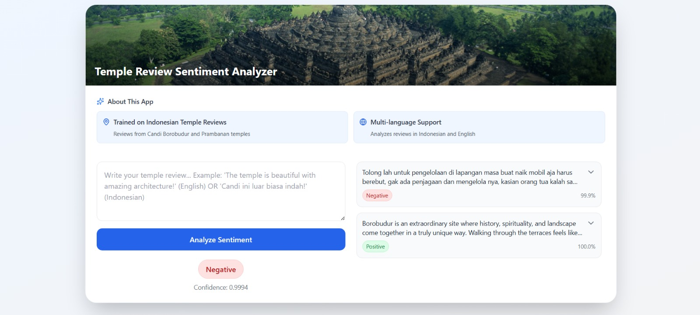

# 🏯 Temple Review Sentiment Analyzer

A sentiment analysis app that analyzes temple reviews in Indonesian and English. 

**Live:** https://temple-review-sentiment.vercel.app

---

## 📸 Screenshots

### Main App


---

## ⚡ Quick Start

### What It Does
- User writes a temple review
- App analyzes sentiment (positive/negative/neutral)
- Shows confidence score

### Run Locally

**Backend:**
```bash
cd backend
pip install -r requirements.txt
uvicorn app.main:app --reload
```

**Frontend:**
```bash
cd frontend
npm install
npm run dev
```

Open http://localhost:5173

---

## 🛠️ Tech Stack

| Part | Tech |
|------|------|
| **Frontend** | React + Vite + Tailwind |
| **Backend** | FastAPI + PyTorch |
| **Model** | Transformer (sentiment classification) |
| **Hosting** | Frontend: Vercel / Backend: Docker on home server |

---

## 📂 Project Layout

```
temple-review-sentiment/
├── backend/               # FastAPI server
│   ├── app/              # Main code
│   └── sentiment-model/  # ML model files
├── frontend/             # React app
│   └── src/
│       └── App.jsx       # Main component
├── docker-compose.yml    # Docker setup
└── DEPLOYMENT.md         # Deployment guide
```

---

## 🚀 Deployment

See [DEPLOYMENT.md](DEPLOYMENT.md) for full steps.

**Quick Deploy:**
```bash
# Backend (home server)
git clone <repo>
docker-compose up --build

# Frontend (Vercel)
git push origin main  # Auto-deploys
```

---

## 🔌 API

**Base URL:** `http://localhost:8000`

**Predict Sentiment:**
```bash
POST /predict
Body: {"text": "The temple is beautiful!"}
Response: {"label": "positive", "confidence": 0.95}
```

**Health Check:**
```bash
GET /health
Response: {"status": "ok"}
```

---

## 🐛 Troubleshooting

| Issue | Fix |
|-------|-----|
| CORS Error | Update `ALLOWED_ORIGINS` in `.env`, restart Docker |
| Backend won't start | Check logs: `docker-compose logs api` |
| Model not found | Run: `scp -r backend/sentiment-model user@server:~/temple-api/backend/` |
| API not responding | Verify backend running: `curl http://localhost:8000/health` |

---

## 📚 More Info

- See [DEPLOYMENT.md](DEPLOYMENT.md) for detailed deployment
- Backend: `backend/app/main.py`
- Frontend: `frontend/src/App.jsx`

**Status:** ✅ Production Ready

